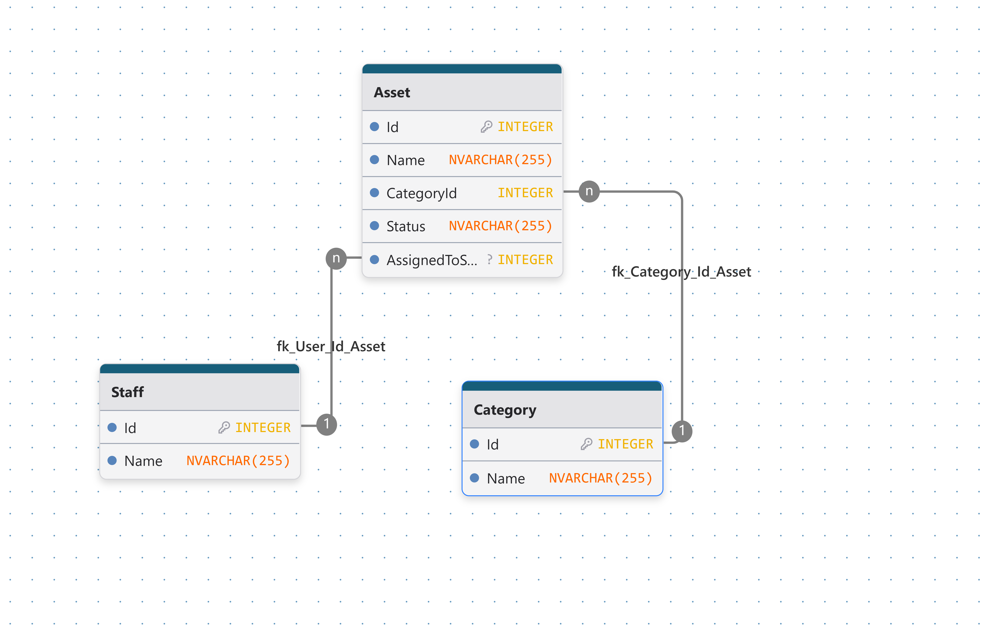

# **Office Asset Tracker**

A simple asset management system built using ASP.NET Web Forms, ADO.NET, and SQL Server stored procedures. The project is designed to simulate a legacy enterprise application.

It allows management of assets, categories, and staff, including assigning assets to staff members, tracking status, and performing basic CRUD operations through stored procedures.

The project emphasizes:

* ASP.NET Web Forms (postbacks, server controls, ViewState)
* ADO.NET data access (SqlConnection, SqlCommand, SqlDataReader)
* SQL Server stored procedures for all data operations
* Relational database design with foreign keys and constraints
* Traditional enterprise-style architecture without ORMs

## ERD-Diagram 

